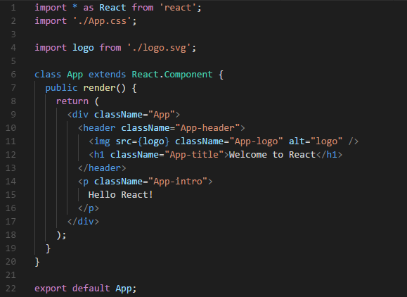

##React
####A JavaScript library for building user interfaces
[React](https://reactjs.org/)는 유저 인터페이스를 위해 Facebook에서 개발한 오픈 소스 라이브러리로써, 재사용 가능한 UI의 생성을 지원합니다.

리액트는 Virtual Dom 개념을 사용하여 상태 변화에 따라 선택적인 렌더링을 함으로써 DOM 처리를 최소화합니다. 컴포넌트의 업데이트가 낭비되지 않으니 비용절감에 효과적이겠죠?

아래는 Virtual Dom을 설명한 영상입니다.
  <iframe style="max-width: 560px" width="100%" height="315"
    src="https://www.youtube.com/embed/BYbgopx44vo" frameborder="0" allow="autoplay; encrypted-media" allowfullscreen>
  </iframe>

##Component
위에서 잠깐 언급된 컴포넌트는 리액트에서 작업 단위를 의미하며, 개념상 자바스크립트의 함수와 동일합니다.

Props라는 입력을 받고, 화면에 나타나는 React Element를 반환합니다.

컴포넌트를 생성하는 데에는 크게 클래스를 기반으로 하는 방법과, 함수를 기반으로 생성하는 방법이 있습니다.  

컴포넌트에 관한 이야기는 나중에 하겠습니다. 지금은 '컴포넌트가 이렇구나' 라는 것만 알아두시면 됩니다.

##JSX
####JavaScript XML
React.js는 일반 JavaScript 문법이 아닌, JSX 문법을 사용하여 UI를 탬플릿화 합니다.

JSX는 하나의 문법으로써 HTML과 거의 동일합니다.

리액트 컴포넌트가 React Element를 반환하려면 위 그림과 같이 태그가 닫혀있어야 하며, 최상단의 태그가 반드시 하나여야만 합니다.
