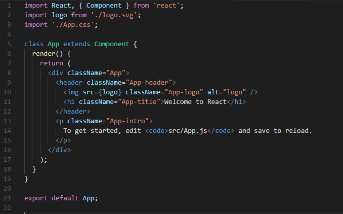
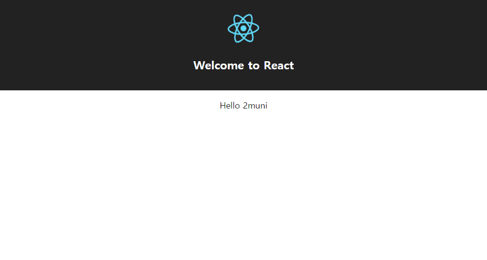
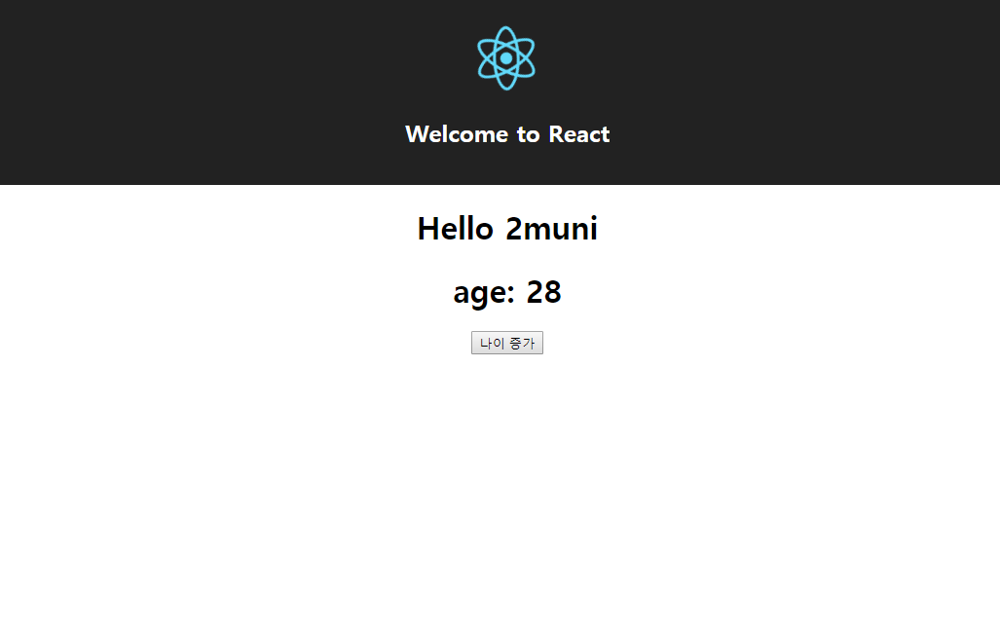
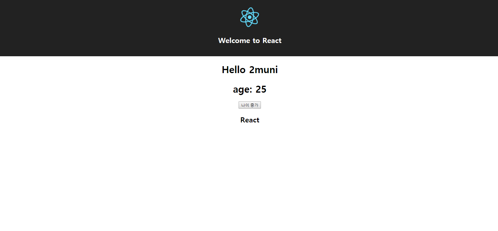

컴포넌트를 설명하기에 앞서, 컴포넌트가 다루는 데이터인 props와 state를 먼저 알아볼까요?

###props
컴포넌트 외부에서 들어오는 데이터입니다. 함수 타입도 전달되며, 전달된 값은 컴포넌트 내부에서 수정할 수 없는 고정된 값입니다.  
외부에서 값이 변경되면 컴포넌트는 render 함수를 재 호출하게 됩니다.

###state
문자 그대로 컴포넌트의 상태를 뜻하는 데이터입니다. 컴포넌트 내부에서만 사용하는 데이터로, 변경 가능하며 조건에 따라 render 함수가 재 호출됩니다.
(초기값은 무조건 다시 렌더링합니다. 이는 다음 포스트인 lifecycle에서 설명하겠습니다.)  
state는 생성자 혹은 초기 할당을 통해 생성하여야 하며, 값을 변경할 때는 반드시 setState 함수를 사용해서 변경하여야 컴포넌트의 리렌더링이 이루어집니다.

<br/>

##Component

컴포넌트는 위와 같은 데이터를 상호간에 주고받으며 애플리케이션의 상태를 유지합니다. 이러한 컴포넌트는 크게 클래스를 기반으로 만들어지는 컴포넌트와 함수를 기반으로 만들어지는 컴포넌트가 있습니다.
####클래스 기반
1. [React.Component](https://reactjs.org/docs/react-component.html)
2. [React.PureComponent](https://reactjs.org/docs/react-api.html#react.purecomponent)

####함수 기반
1. [Stateless Functional Components](https://reactjs.org/docs/components-and-props.html#functional-and-class-components)

각 컴포넌트의 생성 방식이 다른 만큼, 사용법은 조금씩 다릅니다.

##클래스 기반 컴포넌트

React.Component, React.PureComponent를 확장(extends)하여 사용하는 컴포넌트입니다. 

>PureComponent의 경우, shouldComponentUpdate 라이프 사이클 메소드를 다루는 방식을 제외하곤 동일합니다. 따라서, 이번 포스트에선 React.Component를 확장하여 사용하는 컴포넌트만 기술하며, PureComponent는 다음 포스트에서 설명하겠습니다.

먼저, 생성된 프로젝트의 src/App.js를 살펴보겠습니다.


<center><i>React.Component</i></center><br/>

React.Component를 확장하여 생성된 것을 확인하실 수 있습니다.  

그럼, props와 state를 추가하겠습니다.

###props
화면에 Hello 2muni라는 문자열을 출력하려고 합니다. 2muni는 컴포넌트 내에서 변경할 수 없는 고정된 값으로, 외부에서 입력되어야만 합니다. 다시 말해, props로 지정하고자 합니다.

src/App.js의 코드를 다음과 같이 수정해 주세요.

```javascript
(...)

class App extends Component {
  render() {

    const { name } = this.props;

    return (
      (...)
        <p className="App-intro">
          Hello {name}
        </p>
      (...)
```

name은 props객체를 비구조화하여 할당된 값입니다. 자세한 사항은 [비구조화 할당](https://developer.mozilla.org/ko/docs/Web/JavaScript/Reference/Operators/Destructuring_assignment)을 참고하세요.

앞서 props는 컴포넌트의 외부에서 입력되는 데이터라 했었죠? 지금은 단순히 props를 받아오기 위한 준비만 했을 뿐, 실질적인 데이터 입력은 없습니다.  
App 컴포넌트가 사용되어지는 src/index.js파일을 다음과 같이 수정해 주세요.

```javascript
(...)
ReactDOM.render(
  <App name='2muni'/>,
  document.getElementById('root') as HTMLElement
);
(...)
```

App 컴포넌트의 props에 name 값을 추가했습니다. 수정 후 페이지를 로드하면 다음과 같은 화면이 출력됩니다.


<center><i>Hello props</i></center><br/>

데이터가 정상적으로 입력된 것을 확인할 수 있습니다.

###state
화면에 나이 값을 출력하고, 버튼을 클릭하면 값이 증가하고자 합니다. 상태에 따라 유동적으로 변화하는 값은 state를 사용해야겠죠?

src/App.js의 코드를 다음과 같이 수정해 주세요.

```javascript
(...)
class App extends Component {

  state = {
    age: 25,
  }

  increment = () => { 
    this.setState({
      age: this.state.age +1
    })
  }

  render() {

    const { name } = this.props;
    const { age } = this.state;

    return (
      <div className="App">
        <header className="App-header">
          
          <h1 className="App-title">Welcome to React</h1>
        </header>
        <h1>Hello {name}</h1>
        <h1>age: {age}</h1>
        <button onClick={this.increment}>나이 증가</button>
      </div>
    );
  }
}

export default App;
```
먼저 App 클래스 내부에 state를 선언하여 age 변수에 값을 할당합니다. 그 후, 컴포넌트 내에서 state 값을 수정하는 이벤트를 선언합니다.

우선 state 값을 변경하는 함수를 선언합니다. increment라는 이름의 함수를 선언하고, 함수 내부에 setState 함수를 수행하여 age의 값을 변경합니다. 해당 함수는 [화살표 함수 표현](https://developer.mozilla.org/ko/docs/Web/JavaScript/Reference/Functions/%EC%95%A0%EB%A1%9C%EC%9A%B0_%ED%8E%91%EC%85%98)을 사용하여 bind를 수행하지 않습니다.  
이후 클릭 이벤트가 수행 될 버튼을 만들어 click 이벤트를 할당합니다. 할당 시 함수 수행식으로 할당하지 않도록 주의하세요.

수정 후 버튼 이벤트가 수행되는지 확인해 보세요.


<center><i>Hello state</i></center><br/>

버튼이 잘 동작하나요? 이로써 우리는 클래스 기반의 컴포넌트에서 props와 state를 통해 정상적으로 데이터를 출력하였습니다!  
다음으로 함수 기반 컴포넌트에 관해 알아보겠습니다.

##함수 기반 컴포넌트

Stateless Functional Components(SFC)는 문자 그대로 state가 없는 함수형 컴포넌트입니다. 또한 lifecycle을 사용하지 않습니다. 때문에 성능상 미세하게 클래스 기반의 컴포넌트보다 초기 마운트가 빠르고 메모리 자원을 덜 사용합니다. 미비한 차이긴 하지만, state와 lifecycle을 사용하지 않는 컴포넌트라면 [함수형으로 생성하는 것이 좋습니다.](https://hackernoon.com/react-stateless-functional-components-nine-wins-you-might-have-overlooked-997b0d933dbc)

src 디렉토리에 Stateless.js파일을 생성하고 다음 코드를 작성해 주세요.

```javascript
import * as React from 'react';

const StatelessComponent = ({ label }) => (
  <h2>{label}</h2>
)
StatelessComponent.defaultProps = defaultProps;

export default StatelessComponent;
```

함수형 컴포넌트는 매개변수로 props를 가져오는데, 이 때 매개변수로 받은 props를 비구조화 할당하여 표현할 수 있습니다.  
label이라는 이름의 데이터는 해당 컴포넌트 외부에서 입력되는 값입니다. 다시 말하자면, 컴포넌트 외부에서 label이라는 프로퍼티로 입력되는 데이터입니다.

이러한 함수형 컴포넌트는 render함수가 따로 없습니다. 함수가 return한 jsx 데이터가 render되는 방식으로 작동하게 됩니다.

또한 코드 말미에 선언한 defaultProps는 props로 받은 값이 없을 경우, 컴포넌트에서 기본적으로 출력하는 값입니다.
defaultProps는 위와 같이 컴포넌트의 프로퍼티로 접근해도 되고 다음과 같이 선언할 수 있습니다.

```javascript
import * as React from 'react';

const StatelessComponent= ({ label='default label' }) => (
  <h2>{label}</h2>
)

export default StatelessComponent;
```

다시 돌아와서, 작성한 컴포넌트를 적용시켜 보겠습니다.

먼저, src/App.js의 내부에 해당 컴포넌트를 import 하겠습니다.

```javascript
import StatelessComponent from './Stateless';
```

그러고 나서, render 함수의 return 부분에 StatelessComponent를 추가해주세요.

```javascript
return (
      <div className="App">
        <header className="App-header">
          
          <h1 className="App-title">Welcome to React</h1>
        </header>
        <h1>Hello {name}</h1>
        <h1>age: {age}</h1>
        <button onClick={this.increment}>나이 증가</button>
        <StatelessComponent />
      </div>
    );
```

우리가 설정한 문자열, default label이 정상적으로 출력되나요? 아직 우리는 컴포넌트에 props를 입력하지 않았기 때문에 해당 문자열이 출력됩니다.

props를 입력해볼까요? "React"라는 문자열을 입력해 보겠습니다. 

```javascript
<StatelessComponent label="React" />
```


컴포넌트의 프로퍼티에 접근하듯이, 아까 선언한 label이라는 이름으로 입력합니다.




"React"라는 문자열이 정상적으로 출력되나요?

이번 포스트에선 리액트의 컴포넌트와 props, state에 대하여 알아보았습니다. 다음은 리액트의 lifecycle에 대해 알아보겠습니다.